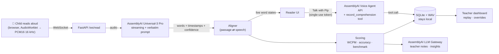

# 🦉 ReadAlong

**An AI reading coach that listens to children read aloud, word by word, in real time.**

A child reads a story out loud. Words turn green as they're read correctly, Pip the owl steps in when they get stuck, and afterwards Pip *talks with them* about the story to check they understood it. Teachers and parents get a complete running record (words correct per minute, accuracy, every miscue, a recording of every word) without spending a minute of one-on-one time.

---

## The problem

Learning to read needs someone to **listen**. The only way to catch the words a child stumbles on is to hear them read aloud, and in a class of 25 that listening barely happens.

- **Assessment is manual.** Schools screen oral reading fluency several times a year. A teacher sits with each child, a stopwatch and a paper copy of the passage, marking every error by hand. That's hours per class, per round, and the data arrives once a season.
- **Practice goes unheard.** Between assessments, most reading-aloud practice has no one listening, so mistakes get practised instead of corrected.
- **It's hardest where English isn't spoken at home.** In Sri Lanka, only 22% of people over 15 are literate in English, national assessments put average English scores at 54% in grade 4 and 36% in grade 8, and rural schools trail urban ones by significant margins ([IPS, 2018](https://www.ips.lk/talkingeconomics/2018/04/23/building-a-more-english-literate-sri-lanka-the-need-to-combat-inequities/)). A child in a rural village learning to read English often has no one at home who can listen and correct them. ReadAlong can.
- **Even rich countries struggle.** 40% of US fourth graders read below the NAEP Basic level, the highest share since 2002 ([NAEP 2024](https://www.nationsreportcard.gov/reports/reading/2024/g4_8/national-trends/?grade=4)).

## What ReadAlong does

| For the child | For teachers and parents |
|---|---|
| 📖 **Live word tracking.** Every word lights up as it's read. | 📊 **Class dashboard.** WCPM vs grade benchmark, accuracy, trend and comprehension for every student, sorted by who needs help first. |
| 🦉 **Stuck-word rescue.** Silent on one word for 4.5s? Pip says it gently and the child carries on, just like a patient adult. | 🎧 **Word-level audio replay.** Click any word to hear exactly how the child read it. |
| ⭐ **Celebration and specific praise.** Stars, confetti and two true sentences from Pip about *their* reading. | ✅ **Teacher-in-the-loop.** Words the AI wasn't sure about are flagged "needs your check", never marked wrong. One click decides and the scores update. |
| 🎤 **Tricky-word practice.** Hear the word, say it, and Pip checks it. | 🧠 **Miscue analysis.** Running-record notes and cross-session coaching insights (patterns plus next steps) from the LLM Gateway, grounded in the actual missed words. |
| 💬 **Talk with Pip.** A real voice conversation: *"What happened in the story? Why did the elephant go looking for water?"* | 🖨 **Printable running records** and progress reports. |

**In the classroom**, a teacher sees the whole class at a glance, sorted by who needs help first. **At home**, a parent uses the same view to follow their own child: the progress chart, the words they struggle with, and a recording of how they read each one. Children who read with Pip every day build a clear picture of their progress far faster than a few assessments a year.

## How it works



### How AssemblyAI is used

| Capability | How ReadAlong uses it |
|---|---|
| **Universal-3 Pro streaming** (`universal-3-6-pro`) | Live transcription of the child's reading over WebSocket. |
| **Prompting** | A verbatim prompt makes the model keep repetitions, false starts ("enor-") and wrong words instead of "fixing" them. That's exactly what a reading teacher needs to see. |
| **Word timestamps** | Hesitation detection, reading time (WCPM), and word-level audio replay for teachers. |
| **Word confidence** | Separates real reading errors from transcription uncertainty (see *confidence gating* below). |
| **Turn silence tuning** | `min/max_turn_silence` raised because children pause mid-sentence. |
| **Voice Agent API** | "Talk with Pip": an inline-configured agent per story (system prompt with the passage and questions, greeting, voice, child-friendly turn detection) with a JSON-Schema **client-side tool** `record_comprehension` that saves the retell quality and answers to the session. The browser connects with a **single-use temporary token**, so the API key never leaves the server. |
| **LLM Gateway** | Running-record notes per reading and cross-session coaching insights for the teacher. |

## Design decisions (backed by experiments)

Every one of these came from a test against the real API, not a guess.

**1. A verbatim prompt, but not the passage in the prompt.** Test audio: *"The, the enor- enormous elephant walked slow… looking for, for water."*

| STT setup | What came back |
|---|---|
| No prompt | `The the an or enormous elephant walked slow…` (the false start becomes "an or") |
| **Verbatim prompt** ✅ | `The, the enor- enormous elephant walked slow… looking for, for water.` |
| Verbatim prompt + passage text | `The enormous elephant walked slow… looking for water.` (repetitions and the false start disappear) |

Giving the model the passage makes it transcribe what the child *should* have said. So ReadAlong never does that.

**2. Confidence gating: never tell a child they're wrong unless we're sure.** In testing, real misreads came back at confidence ≈ 1.0, while transcription slips on correctly read words landed around 0.6 to 0.8. So a mismatch at ≥ 0.85 is a reading error; below that it's flagged **"needs your check"** for the teacher, with one-click audio replay. A lone skipped short word ("a", "the") is also sent to the teacher, since it's as likely a transcription drop as a real omission.

**3. Live highlighting that never flickers red.** The streaming model revises its partial words, so a partial *match* lights green instantly (encouraging), but a partial *mismatch* stays neutral until the turn settles. Partial matches also can't jump further ahead than the words heard, so a stray word can't skip the cursor down the page.

**4. Nothing an LLM writes freely is said to a child.** Pip's spoken feedback is built from facts (what the child read, fixed or missed). LLM output goes to adults only, and it's **grounded**: a teacher note that quotes a word the child didn't actually miss is rejected and replaced with a factual summary. Every LLM call has a deterministic fallback, so rate limits never break a session.

**5. Numbers.** The STT writes "3" and "112"; passages say "three" and "one hundred and twelve". Digits are expanded into words that share the original time span before alignment.

## Metrics

| Metric | Definition |
|---|---|
| **WCPM** | (words attempted − errors) ÷ minutes, timed from first to last word spoken |
| **Errors** | misreads + omissions + words Pip had to say + confident insertions. Self-corrections and repetitions are *not* errors (standard running-record practice). |
| **Accuracy level** | ≥ 95% independent · 90 to 94% instructional · < 90% frustration |
| **Benchmark** | 50th percentile oral reading fluency norms by grade and season (Hasbrouck & Tindal, 2017). On track ≥ benchmark · monitor ≥ 80% · needs support below that. A screening signal, not a diagnosis. |
| **Comprehension** | Retell quality (complete / partial / minimal) and questions answered, recorded by Pip's `record_comprehension` tool call |

## Quick start

**Needs:** Python 3.10+, Node 18+, an [AssemblyAI API key](https://www.assemblyai.com/dashboard/api-keys), Chrome or Edge.

```bash
./start.sh            # first run creates backend/.env: add your ASSEMBLYAI_API_KEY, then run again
```

Open **http://localhost:8000**. A demo class (6 students with a few weeks of history) is seeded on first run so the dashboard isn't empty. Demo readings are clearly labelled and have no audio; everything you read live is real.

**Try it:** Kids → Maya → *The Thirsty Elephant* → 🎤 Start reading. Misread a word, stop on one for a few seconds, then finish and 📞 Call Pip. Then open Grown-ups → Maya.

### Development mode

```bash
# backend (port 8000)
cd backend && python3 -m venv venv && venv/bin/pip install -r requirements.txt
cp .env.example .env    # add ASSEMBLYAI_API_KEY
venv/bin/uvicorn main:app --reload --port 8000

# frontend with hot reload (port 5173, proxies /api and /ws to 8000)
cd frontend && npm install && npm run dev
```

| Env var | Default | |
|---|---|---|
| `ASSEMBLYAI_API_KEY` | (required) | |
| `STT_MODEL` | `universal-3-6-pro` | streaming model |
| `LLM_MODEL` | `qwen3.5-4b-32k-fast` | any LLM Gateway model your account can use |
| `SEED_DEMO` | `1` | seed the demo class when the database is empty |

Reset the demo data (and delete local recordings): `cd backend && venv/bin/python seed.py --reset`

### Tests

```bash
cd backend && venv/bin/pytest -q
```

The aligner and scorer are tested against **real Universal-3 Pro output** from a scripted misreading (repetitions, false start, substitution), plus live-partial behaviour, confidence gating, hesitations, spelled-out numbers, told words and teacher overrides.

## Project structure

```
readalong/
├── start.sh                 one-command run
├── backend/
│   ├── main.py              FastAPI: /ws/read, REST API, Voice Agent token, serves the web app
│   ├── stt.py               AssemblyAI streaming client (verbatim prompt, child-friendly turns)
│   ├── aligner.py           passage ⇄ speech alignment, confidence gating, live view
│   ├── scoring.py           WCPM, accuracy, levels, ORF benchmarks
│   ├── llm.py               LLM Gateway notes and insights (grounded, with fallbacks)
│   ├── passages.py          8 original leveled stories (grades 1 to 4) with comprehension questions
│   ├── db.py                SQLite + local WAV storage
│   ├── seed.py              demo class (synthetic, run through the real aligner)
│   └── tests/
└── frontend/
    ├── public/pcm-worklet.js  mic capture + resampling AudioWorklet
    └── src/
        ├── lib/             api, mic, browser speech, Voice Agent client
        ├── components/      Pip (SVG owl), Passage, charts, confetti
        └── pages/           Home, Library, Reader, Results, Teacher, StudentDetail, SessionReplay
```

## Privacy and safety

- **First names only.** No other personal data is collected. LLM Gateway analysis never receives children's names; Pip's voice conversation uses the first name only so it can greet the child.
- **No free-form AI text to children.** See design decision 4.
- **The key never reaches the browser.** The Voice Agent uses single-use temporary tokens.
- **Accessible by design:** Lexend (a typeface designed to improve reading fluency), large reading text, reduced-motion support, keyboard focus styles.

## Roadmap: from hackathon to product

**Accounts and access**
- **Sign-up for schools, teachers and parents**, with class rosters and family accounts.
- **Kid-friendly login:** children tap their avatar or a picture password instead of typing one.
- **PIN-locked Grown-ups area**, so a classroom or family device can be left safely with the kids.
- **A hosted web app** that works on tablets and phones, so grown-ups can check progress from anywhere.

**Adult literacy mode**
Low literacy isn't only a childhood problem. Many adults never had someone to listen to them read, and many are learning English as a second language. They deserve the same patient coach, designed for them:
- **A respectful, grown-up interface:** calm and clean, with no cartoon mascot, stars or grade levels. The same live word tracking and gentle help, without feeling like a children's app.
- **Everyday reading material:** job applications, medicine labels, bus timetables, bank letters, news articles and workplace safety signs.
- **Private by default:** the adult reader is also the one who sees their progress. Nobody else gets a report unless they choose to share it, for example with a literacy tutor.
- **Built for adult programs:** community literacy classes, workplace training and English courses for job seekers.

**Reach families without a laptop**
- **A reading phone line:** call a number and read a story over the phone. The Voice Agent API already supports phone calls over SIP, which suits rural homes with a basic phone and no internet.
- **Weekly progress messages** to parents by SMS or WhatsApp, in their own language.

**Local languages and context**
- **Sinhala and Tamil instructions** for children and parents learning English, so the app is usable before the English is.
- **Stories set in familiar places:** local names, foods, festivals and villages, so children see themselves in what they read.
- **Accent testing across South Asian English**, to make sure the speech model hears local accents correctly.
- **More reading languages** as verbatim transcription accuracy improves in each language.

**Smarter learning**
- **Automatic level recommendations** based on each reader's accuracy and speed.
- **Spaced practice** that brings missed words back at the right time until they stick.
- **Bring your own text:** teachers upload a passage or snap a photo of a book page.
- **Phonics-aligned story libraries** that follow a school's reading programme.

**For schools**
- **Noise suppression and headset mode** for busy classrooms and reading corners.
- **School and district dashboards**, plus export to Google Classroom and school information systems.
- **Consent flows, data retention controls** and compliance with child privacy law (COPPA and FERPA in the US, and local equivalents).

## Note

Built on **AssemblyAI** for the [AssemblyAI Voice Agent Hackathon](https://lablab.ai/ai-hackathons/assemblyai-voice-agent-hackathon): Universal-3 Pro streaming STT, the Voice Agent API and the LLM Gateway.

## License

MIT. See [LICENSE](LICENSE). All stories were written for this project.
